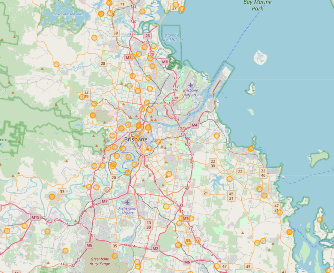

# Geocoding and Mapping patients for IMB

This private repository provides code for geocoding and mapping patients for [IMB](https://imb.uq.edu.au).

<br><br>
## What it does
- **Input**:  
  - a set of adresses at .csv format. Only one column. Each adress is a row. *Needs to be changed with new addresses*.
  - a set of adresses that have already been geocoded. This is an R object called `adress_with_gps.RData`. *Don't touch it*.

- **Step 1**: the script `script_geocode.R` is first going to extract the addresses that haven't been geocoded yet. It will geocode them using the `opencage` R library and update the list of geocoded addresses: `adress_with_gps.RData`.

- **Step 2**: the script `script_runAllRmd.R` will run all the `Rmd` files: one per Australian country. It will produce the `html` files we want to display online.

- **Output**: one `html` file per city. The file provides a map of the city with one circle per geocoded patient:


<br><br>
## How to use the pipeline
Start by cloning this whole repository. Then, only 1 line of code is necessary to update the html outputs:

```r
./script_update_maps.sh
```

<br><br>
## Requirements & limitations
A few R libraries need to be installed for the pipeline to work properly
```r
library(dplyr)
library(opencage)
library(leaflet)
```
Note that the geocoding step is limited to 2500 calls / day.
